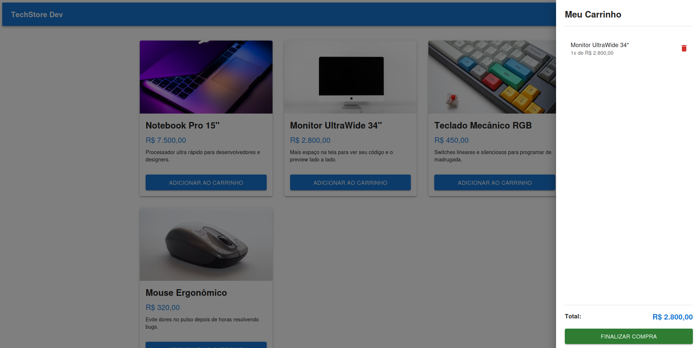

# 🛒 TechStore Dev - Mini E-commerce

[🇺🇸 English](./README.md) | [🇧🇷 Português](./README.pt-br.md)

A responsive mini e-commerce application built with **React**, **TypeScript**, and **Material UI (MUI)**. This project was developed for my portfolio to demonstrate modern Front-end development practices, state management, data persistence, and responsive UI design.

## 📸 Demo

<p align="center">
  
</p>

---

## ✨ Features

* 📦 Dynamic product listing.
* 🛒 Shopping cart with quantity management.
* ➕ Automatic grouping of duplicate products.
* 💾 Data persistence using **LocalStorage**.
* 📱 Fully responsive interface.
* 📊 Automatic calculation of the cart total.
* 🗑️ Individual item removal.
* 🔔 User feedback with **Material UI Snackbar** and **Alert** components.

---

## 🛠️ Technologies

* React 18/19
* TypeScript
* Material UI (MUI)
* Emotion
* Vite
* LocalStorage API

---

## 📂 Project Structure

```text
src/
├── assets/
├── components/
│   ├── CartDrawer.tsx
│   ├── Header.tsx
│   ├── ProductCard.tsx
│   └── SnackbarAlert.tsx
├── mock/
│   └── products.ts
├── interfaces/
│   └── Product.ts
├── App.tsx
└── main.tsx
```

---

## 💡 Technical Concepts

This project was designed to apply important React development concepts.

### State Management

The shopping cart is managed using React's `useState` hook, ensuring predictable and reactive state updates.

### Immutable State Updates

All cart updates use React callback functions:

```tsx
setCart((prevCart) => {
    // Update based on the previous state
});
```

This approach prevents issues related to asynchronous state updates and race conditions.

### Array Manipulation

Several JavaScript array methods were used to implement the application's business logic:

* `find()`
* `map()`
* `filter()`
* `reduce()`

These methods are responsible for:

* locating products;
* updating quantities;
* removing items;
* calculating the cart total;
* preventing duplicate entries.

### Local Data Persistence

The shopping cart remains available even after refreshing the page by using the browser's native **LocalStorage API**.

```javascript
localStorage
```

---

## 🎨 Responsive Design

The interface was built with Material UI components and CSS Grid through the `Box` component, providing a clean and responsive layout across different screen sizes.

---

## 🚀 Getting Started

### Clone the repository

```bash
git clone https://github.com/paullo-ps/mini-e-commerce.git
```

### Navigate to the project folder

```bash
cd mini-e-commerce
```

### Install dependencies

**Using npm**

```bash
npm install
```

**Using Yarn**

```bash
yarn
```

### Start the development server

**Using npm**

```bash
npm run dev
```

**Using Yarn**

```bash
yarn dev
```

The application will be available at:

```text
http://localhost:5173
```

---

## 📚 What I Learned

This project helped reinforce my knowledge of:

* React Hooks
* Component-based architecture
* TypeScript
* Material UI
* State management
* Data persistence
* JavaScript array manipulation
* Responsive design
* Front-end development best practices

---

## 🔮 Future Improvements

* REST API integration.
* Product details page.
* User authentication.
* Favorites (Wishlist).
* Product search.
* Category filtering.
* Price sorting.
* Checkout flow.
* Global state management with Context API or Redux.
* Unit tests using Vitest and React Testing Library.

---

## 👨‍💻 Author

**Paulo Sérgio Mendes dos Santos**

* GitHub: https://github.com/paullo-ps
* LinkedIn: https://www.linkedin.com/in/paulo-s%C3%A9rgio-mendes-dos-santos-914a29200/
